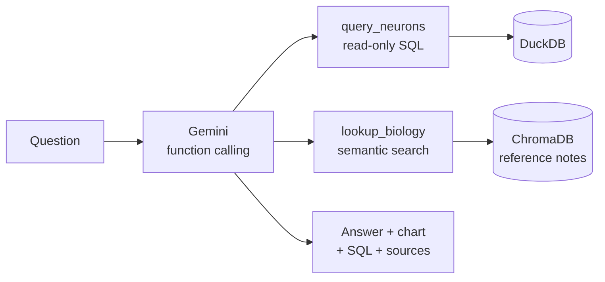

# Chat with NeuroMorpho

Ask plain-English questions about 250,000 digitally reconstructed neurons and glia. Every answer comes with an automatic chart, the SQL behind it, and the reference notes it used.

**Live demo:** https://chat-with-neuromorpho.streamlit.app/ 


## What it does

- **Natural-language questions over real data.** A Gemini model with function calling writes read-only SQL against a DuckDB table of neuron measurements.
- **Grounded explanations.** A ChromaDB index of short reference notes (anatomy, what each measurement means, dataset caveats) is searched for definitions and context.
- **Automatic charts.** Plotly picks a bar, grouped bar, scatter or histogram depending on the shape of the result.
- **Transparent by default.** Each answer shows its SQL, its data table and the notes used.
- **A dataset page** that shows what is, and is not, in the data.

## How it works



## Design decisions

- **Read-only database.** The database is opened read-only and every query passes a guard that allows a single SELECT statement and blocks file-reading functions.
- **Rankings computed in code.** The model is told the ranking of groups instead of working it out, which removed a class of wrong answers.
- **Medians first.** A few very large reconstructions inflate means, so size comparisons lead with medians and show sample sizes.
- **Like-with-like defaults.** Size questions use dendrite-only reconstructions and exclude glia unless asked (see below).
- **Sample rows are labelled as samples.** Raw-value questions use a random sample, and summary statistics are computed over all returned rows.

## What I learned from the data

- In human neocortex, the mean total length (about 6,100 µm) was five times the median (about 1,200 µm). One archive contributes about 2% of those reconstructions but about 59% of the total length.
- Reconstructions that include an axon have a median length about 3.7 times that of dendrite-only ones, and about half of all records are labelled only as "neurites" or "processes". Comparing species without accounting for this gives misleading results.
- About 35% of records are glia, not neurons, so the `cell_type` field has to be filtered for neuron questions.

## Data

Source: [NeuroMorpho.Org](https://neuromorpho.org), a public archive of digital reconstructions contributed by many laboratories.

| | |
|---|---|
| Reconstructions | 252,545 |
| Species included | 52 (of 95 in the archive) |
| Not included | 43 species, mostly small; many failed to download because the API rejected multi-word species names |
| Contents | metadata and computed measurements only; no reconstruction files |

The data is licensed CC BY 4.0. See [`DATA_LICENSE.md`](DATA_LICENSE.md) for the required citations and the list of changes. Each row carries its original paper in `reference_pmid` and `reference_doi`.

## Limitations

- The data is a collection of reconstructions from many labs, not a random sample of neurons. Groups with few reconstructions give unreliable averages.
- Differences between groups reflect biology and lab methods together and are descriptive, not causal.
- Each question is answered independently; there is no conversation memory.
- The `cell_type` field is a mix of true cell types and other labels.
- This is a demonstration project and not a peer-reviewed analysis.

## Tech stack

Python, pandas, DuckDB, ChromaDB, Google Gemini API, Plotly, Streamlit.

## Run it locally

```bash
git clone https://github.com/<your-username>/chat-with-neuromorpho.git
cd chat-with-neuromorpho
python -m venv venv
venv\Scripts\activate            # macOS/Linux: source venv/bin/activate
pip install -r requirements.txt
cp .env.example .env             # Windows: copy .env.example .env, then add your key
streamlit run app.py
```

Get a free API key from Google AI Studio and put it in `.env` as `GEMINI_API_KEY`. On first start the app builds its database from `data/neurons.parquet`.

## Project structure

```
app.py                    Streamlit interface (Chat, Dataset, About)
src/engine.py             database, notes search, Gemini agent
src/charts.py             automatic chart selection and styling
data/neurons.parquet      the dataset (derived from NeuroMorpho.Org)
data/knowledge/           reference notes and the full species list
assets/style.css          interface styling
```

## Privacy and security

- The API key is read from an environment variable or Streamlit's secret store and is never committed.
- Questions are sent to Google's Gemini API. Please do not enter personal information.

## License and credit

Code: MIT (see `LICENSE`). Data: CC BY 4.0 from NeuroMorpho.Org (see `DATA_LICENSE.md`).

If you use this data, please cite the original papers, NeuroMorpho.Org (RRID:SCR_002145), and Tecuatl C, Ljungquist B, Ascoli GA (2024) *FASEB BioAdvances* 6(7):207-221, doi:10.1096/fba.2024-00048.

This project is independent and is not affiliated with NeuroMorpho.Org or Google.

Built by Asita.
